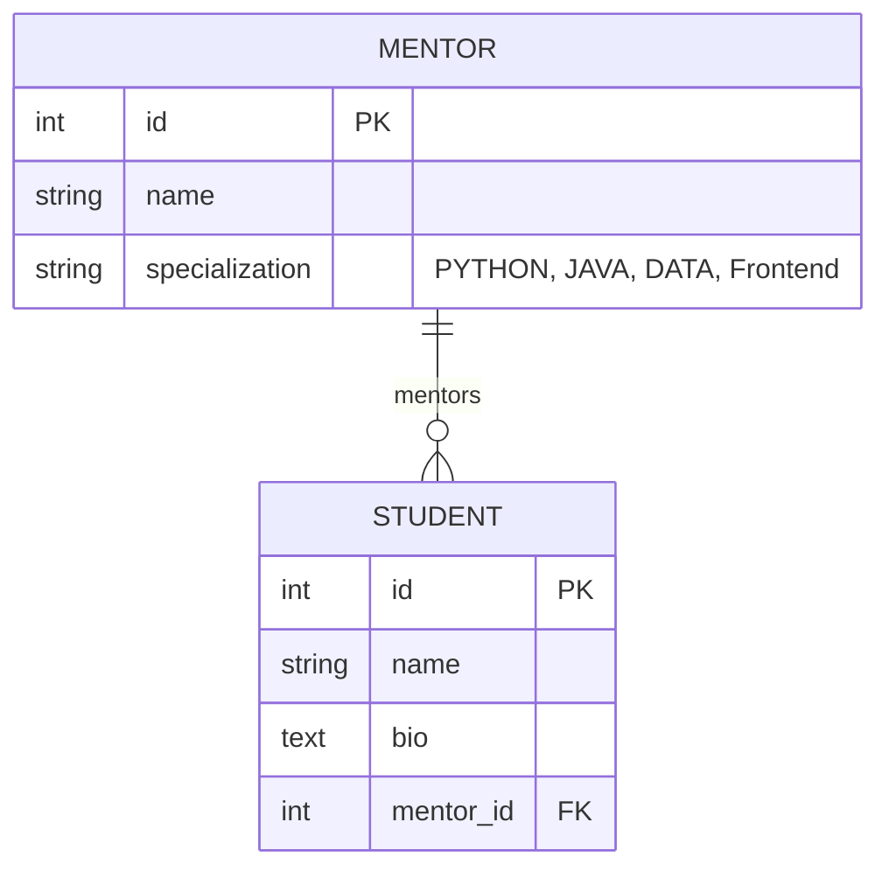
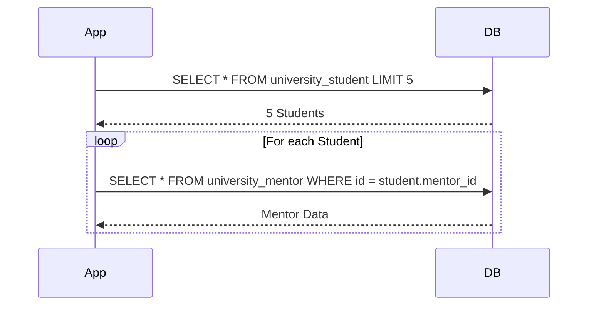

# Django ORM Optimization

> Helper project for analyzing optimization in Django (based on the [article](https://www.devs-mentoring.pl/optymalizacja-w-django/) from devs-mentoring.pl).

______________________________________________________________________

## 📋 Table of Contents

- [Setup Instructions](#-setup-instructions)
- [Data Generation and Loading](#-data-generation-and-loading)
- [Useful Commands](#-useful-commands)
- [Database Schema](#-database-schema)
- [Experiments](#-experiments)
  - [Built-in Cache Mechanism](#1-built-in-cache-mechanism)
  - [Updating Specific Fields](#2-updating-specific-fields)
  - [The N+1 Problem](#3-the-n1-problem)
  - [select_related vs prefetch_related](#4-select_related-vs-prefetch_related)
- [Optimization Tips](#-optimization-tips)
  - [count() vs len()](#1-use-count-instead-of-len)
  - [first() and last()](#2-retrieve-the-first-and-last-elements-using-first-and-last)
  - [exists() Method](#3-the-exists-method)
  - [Declarative vs Imperative](#4-a-declarative-approach-instead-of-an-imperative-one)
- [Resources](#-resources)

______________________________________________________________________

## 🛠 Setup Instructions

### 1. Create and activate a virtual environment

```bash
python -m venv venv
source venv/bin/activate  # On Windows: venv\Scripts\activate
```

### 2. Install dependencies

```bash
pip install -r requirements.txt
```

### 3. Database migrations

```bash
python manage.py migrate
```

> **Note:** The project structure (core and university app) is already provided in this repository.

______________________________________________________________________

## 📊 Data Generation and Loading

### 1. Generate data

To generate a file with 100 mentors and 100,000 students:

```bash
python generate_data.py
```

This will create a `data.json` file (approx. 27 MB).

### 2. Load data into the database

```bash
python manage.py loaddata data.json
```

______________________________________________________________________

## ⌨️ Useful Commands

- **Run server:** `python manage.py runserver`
- **Create superuser:** `python manage.py createsuperuser`
- **Django shell:** `python manage.py shell`
- **Shell Plus (with SQL printing):** `python manage.py shell_plus --print-sql`

______________________________________________________________________

## 🧬 Database Schema

Below is the visualization of the models used in this project:



______________________________________________________________________

## 🧪 Experiments

All experiments are conducted using [django-extensions](https://django-extensions.readthedocs.io/en/latest/shell_plus.html) `shell_plus`.

```bash
python manage.py shell_plus --print-sql
```

### 1. Built-in Cache Mechanism

Django's QuerySets are lazy and [cached](https://docs.djangoproject.com/en/stable/topics/db/queries/#caching-and-querysets).

| Execution | Time     | Action             |
| :-------- | :------- | :----------------- |
| First     | ~0.0008s | Hits Database      |
| Second    | ~0.0001s | Returns from Cache |

### 2. Updating Specific Fields

When calling `.save()`, Django updates all fields by default. Use `update_fields` to optimize the SQL `UPDATE` statement.

**Inefficient:**

```python
mentor.save()  # Updates ALL fields: name AND specialization
```

**Optimized:**

```python
mentor.save(update_fields=["name"])  # Updates ONLY 'name'
```

Alternatively, use the `.update()` method on a QuerySet:

```python
Mentor.objects.filter(id=1).update(name="New Name")
```

### 3. The N+1 Problem

The N+1 problem occurs when you fetch a list of objects and then perform an additional query for each object to fetch a related one.



### 4. `select_related` vs `prefetch_related`

| Method                                                                                                | Relationship Type              | Strategy                 | Documentation                                                                           |
| :---------------------------------------------------------------------------------------------------- | :----------------------------- | :----------------------- | :-------------------------------------------------------------------------------------- |
| [`select_related`](https://docs.djangoproject.com/en/stable/ref/models/querysets/#select-related)     | ForeignKey, OneToOne           | SQL JOIN                 | [Docs](https://docs.djangoproject.com/en/stable/ref/models/querysets/#select-related)   |
| [`prefetch_related`](https://docs.djangoproject.com/en/stable/ref/models/querysets/#prefetch-related) | ManyToMany, reverse ForeignKey | Separate Query + joining | [Docs](https://docs.djangoproject.com/en/stable/ref/models/querysets/#prefetch-related) |

Example of `prefetch_related` reduction:

- Without optimization: **N + 1 queries**.
- With `prefetch_related`: **2 queries** (one for main objects, one for all related objects using `IN (id1, id2, ...)`).

______________________________________________________________________

## 💡 Optimization Tips

### 1. Use `count()` instead of `len()`

- `len(queryset)`: Loads all records into memory and counts them in Python.
- `queryset.count()`: Executes `SELECT COUNT(*)` on the database.

### 2. Retrieve the first and last elements using `first()` and `last()`

Avoid index access `[0]` which raises `IndexError` if the QuerySet is empty. [`.first()`](https://docs.djangoproject.com/en/stable/ref/models/querysets/#first) returns `None` safely.

### 3. The `exists()` Method

Use [`.exists()`](https://docs.djangoproject.com/en/stable/ref/models/querysets/#exists) for boolean checks to avoid loading data.

```python
if Mentor.objects.filter(id=3).exists():
    print("Mentor exists")
```

### 4. A Declarative Approach Instead of an Imperative One

Python's functional tools like `map()` and `filter()` can often outperform manual `for` loops in specific scenarios.

**Example Comparison:**
Calculating squares of even numbers in `range(1, 10_000_000)`.

| Approach                     | Typical Time |
| :--------------------------- | :----------- |
| **Imperative** (for-loop)    | ~1.00s       |
| **Declarative** (map/filter) | ~0.000002s   |

______________________________________________________________________

## 📚 Resources

- [Official Django Documentation](https://docs.djangoproject.com/en/stable/)
- [Django QuerySet API Reference](https://docs.djangoproject.com/en/stable/ref/models/querysets/)
- [Database Access Optimization Guide](https://docs.djangoproject.com/en/stable/topics/db/optimization/)
- [Original Article (Polish)](https://www.devs-mentoring.pl/optymalizacja-w-django/)
